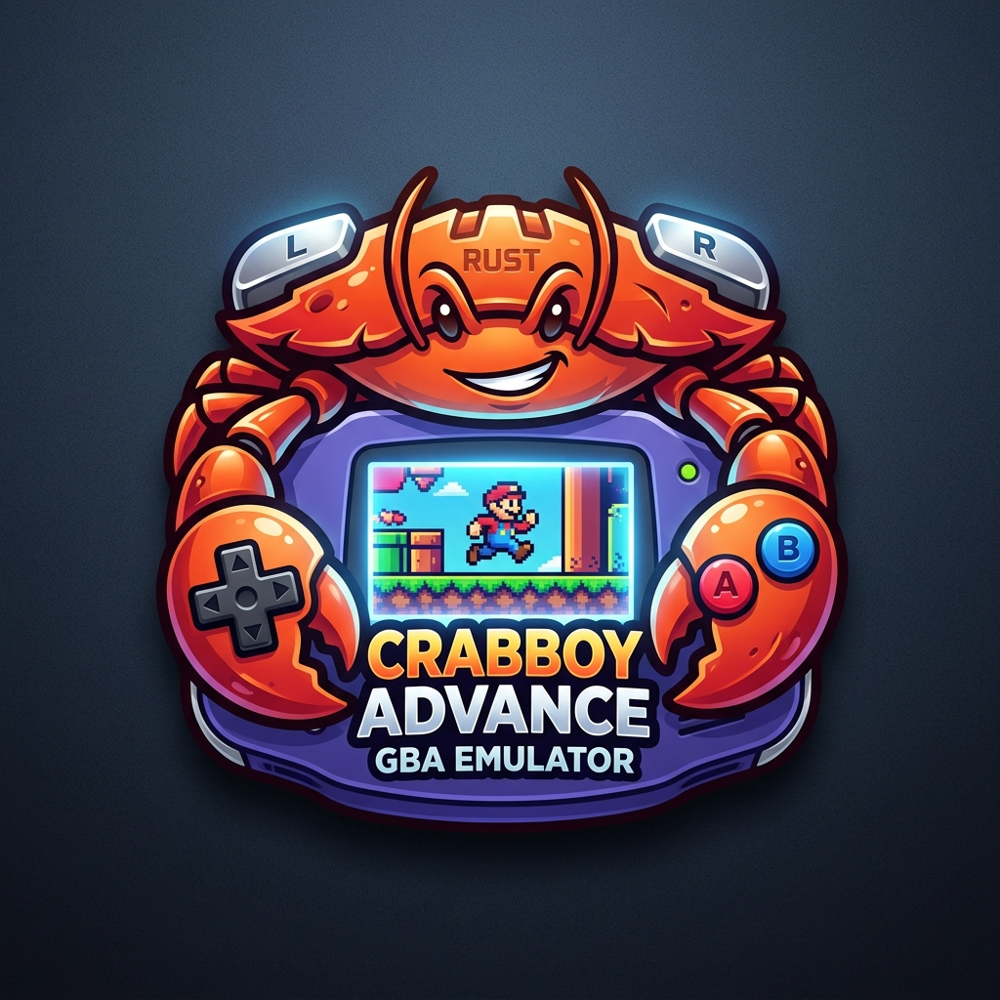
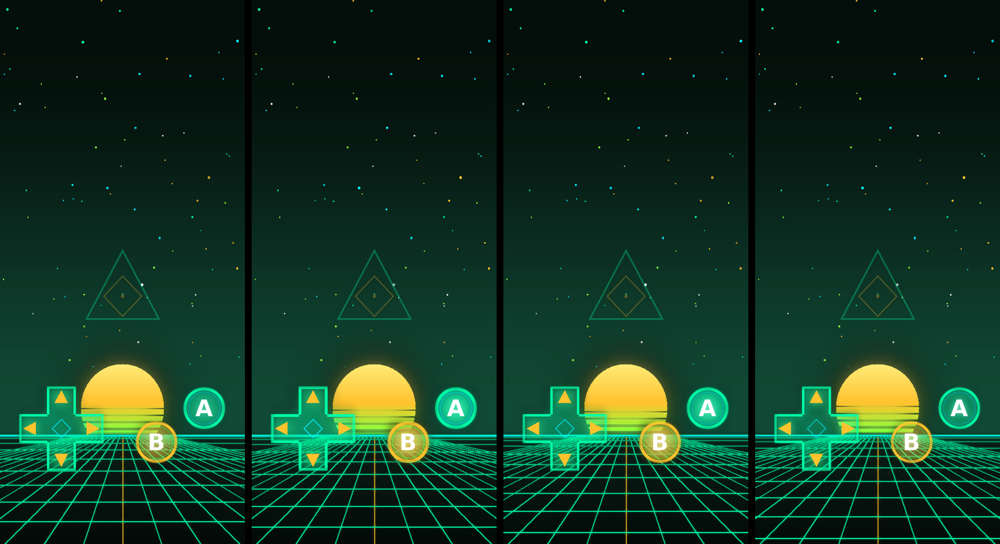

<div align="center">

  

  # CrabBoy Advance

  ### *Relive the Golden Age of Handheld Gaming — Reimagined.*

  A beautifully crafted, high-fidelity Game Boy Advance emulator designed for pure nostalgia, breathtaking visuals, and effortless fun.

  [](https://github.com/ssilkdev/CrabBoy-Advance/releases/latest)
  [](https://github.com/ssilkdev/CrabBoy-Advance/releases)
  [](https://www.rust-lang.org/)
  [](LICENSE)

  <br />

  [**🚀 Download v5.2.0**](https://github.com/ssilkdev/CrabBoy-Advance/releases/tag/v5.2.0) &nbsp;•&nbsp;
  [**📖 User Manual**](USER_MANUAL.md) &nbsp;•&nbsp;
  [**🎨 Skin Gallery**](docs/SKINS.md) &nbsp;•&nbsp;
  [**✨ Features**](#-why-youll-love-crabboy-advance) &nbsp;•&nbsp;
  [**🎮 Controls**](#-controls--shortcuts)

</div>

<br />

<div align="center">
  
  <p><i>Featured: Animated Emerald-Synthwave custom theme running with responsive touch controls on Android.</i></p>
</div>

---

## 🌟 Why You'll Love CrabBoy Advance

CrabBoy Advance brings back everything you loved about the 32-bit handheld era, enriched with modern magic:

### 🎨 Breathtaking Visuals
Say goodbye to blurry pixel stretches. Experience your favorite classics in razor-sharp high definition with **smart xBRZ upscaling**, authentic retro **LCD color profiles**, ambient screen glow, and nostalgic shell bezels that look gorgeous on 4K monitors and mobile screens alike.

### 🎧 Concert-Hall Audio
Every trumpet fanfare, battle drum, and iconic 8-bit chirp comes through with crystal clarity. Choose between **Pure Studio Stereo**, **3D Headphone Surround Sound** for late-night gaming without ear fatigue, or **HD Music Re-Synthesis** that breathes new acoustic depth into classic soundtracks.

### ⏳ Instant Rewind & Time Travel
Mistimed a difficult jump in *Metroid Fusion* or accidentally knocked out that Shiny Pokémon? Simply hold down the **Rewind button** to seamlessly roll back time and rewrite history.

### 📱 Play Anywhere: Desktop & Android
Enjoy a seamless experience on **Windows**, **Linux**, and **Android**. Take your games on the go with fully customizable touch controls, haptic vibration, and gorgeous animated skin packs — or kick back at your desk with your favorite Bluetooth or USB controller.

### 🤖 Hand the Controller to an AI
Curious to see how artificial intelligence approaches retro games? Turn on the **AI Agent Companion** (`Ctrl + A`)! Watch an intelligent AI look at the screen in real-time, reason through puzzles, and battle its way through levels while you sit back with popcorn.

### 🤝 Trade, Battle & Connect
Relive the excitement of the link cable! CrabBoy Advance includes built-in wireless multiplayer simulation so you can battle and trade Pokémon or race against friends over your local network without any messy hardware setup.

### 📖 Built-In Illustrated Guide & Cheats
Stuck on a route or looking for a hidden evolution? Press `F1` anytime to open the **Illustrated Trainer's Field Guide**, baked directly into the app. Need a boost? Enjoy instant one-click support for GameShark, Action Replay, and CodeBreaker cheats.

---

## 🚀 Quick Start Guide

### Step 1: Download
Head to the **[Latest Release Page](https://github.com/ssilkdev/CrabBoy-Advance/releases/latest)** and grab the bundle for your device:
- **📱 Android:** Download `crabboy-advance-release.apk` and tap to install.
- **🐧 Linux:** Download `crabboy-advance-v5.2.0-linux-x86_64.tar.gz`, extract, and double-click to play.
- **🪟 Windows:** Download the portable Windows release executable.

### Step 2: Load Your Game
CrabBoy Advance is a player for your legally owned Game Boy Advance (`.gba`), Game Boy (`.gb`), and Game Boy Color (`.gbc`) files:
- **Desktop:** Simply drag and drop your game file into the window, or use `File ➔ Open ROM`.
- **Android:** Tap the folder icon, pick your game folder, and launch.

### Step 3: Play & Have Fun!
Plug in any modern Xbox, PlayStation, Switch, or generic USB controller — it works right out of the box! Or use your keyboard with the intuitive default controls below.

---

## 🎮 Controls & Shortcuts

### Gamepad & Keyboard
| GBA Button | Default Keyboard Key | Controller Equivalent |
| :--- | :--- | :--- |
| **D-Pad** | <kbd>↑</kbd> <kbd>↓</kbd> <kbd>←</kbd> <kbd>→</kbd> Arrow Keys | D-Pad / Left Analog Stick |
| **A Button** | <kbd>Z</kbd> | Bottom Face Button (<kbd>A</kbd> / <kbd>×</kbd>) |
| **B Button** | <kbd>X</kbd> | Left Face Button (<kbd>B</kbd> / <kbd>□</kbd>) |
| **L Shoulder** | <kbd>A</kbd> | Left Bumper / Trigger (<kbd>LB</kbd> / <kbd>L1</kbd>) |
| **R Shoulder** | <kbd>S</kbd> | Right Bumper / Trigger (<kbd>RB</kbd> / <kbd>R1</kbd>) |
| **Start** | <kbd>Enter</kbd> | <kbd>Start</kbd> / <kbd>Options</kbd> |
| **Select** | <kbd>Backspace</kbd> | <kbd>Select</kbd> / <kbd>Share</kbd> |

### Essential Hotkeys
- **<kbd>Space</kbd> (Hold):** Fast-Forward / Turbo (speed through grinding and dialogue)
- **<kbd>Tab</kbd> / <kbd>Backspace</kbd> (Hold):** ⏳ Live Rewind (undo mistakes instantly)
- **<kbd>F5</kbd> / <kbd>F8</kbd>:** Quick Save / Quick Load State
- **<kbd>P</kbd>:** Pause / Resume Emulation
- **<kbd>F1</kbd>:** Open Illustrated Strategy Guide & User Manual
- **<kbd>Ctrl</kbd> + <kbd>A</kbd>:** 🤖 AI Agent Player Autopilot
- **<kbd>Ctrl</kbd> + <kbd>C</kbd>:** Cheat Engine (GameShark / Action Replay)

---

## 🎨 Themes & Custom Skins

Make your emulator look uniquely yours! CrabBoy Advance supports dynamic custom skins with animated backgrounds, glow effects, and interactive touch controls for mobile.

- **Pre-installed Themes:** Classic Indigo, Glacier Blue, GBA SP Flame Red, and Game Boy Player.
- **Animated Skin Packs:** Try the popular **Emerald Synthwave** theme (included in the releases), or create your own custom skins using our [Skin Creation Guide](docs/SKINS.md).

---

## 📚 Learn More & Documentation

Looking for deeper guides or curious about the project roadmap?
- **[📖 Comprehensive User Manual](USER_MANUAL.md)** — A friendly, complete walkthrough of every feature with zero technical jargon.
- **[🎨 Skin Authoring Guide](docs/SKINS.md)** — How to create, style, and share your own custom themes.
- **[🗺️ Project Roadmap](docs/ROADMAP.md)** — See what exciting features and updates are on the horizon.

---

<details>
<summary><b>🛠️ Building from Source (For Developers & Power Users)</b></summary>
<br />

CrabBoy Advance is written in pure, high-performance [Rust](https://www.rust-lang.org/) (2021 edition) with cycle-accurate timing and an optimized multi-tier execution engine.

### Prerequisites
- Rust 1.75 or later (`cargo`, `rustc`)
- C compiler (`gcc` or `clang`) and `pkg-config`

### Linux
```bash
# Ubuntu / Debian dependencies
sudo apt install build-essential pkg-config libasound2-dev libudev-dev \
    libgl1-mesa-dev libxkbcommon-dev libwayland-dev libx11-dev

# Build optimized release binary
cargo build --release

# Run
./target/release/crabboy-advance "path/to/game.gba"
```

### Windows
```powershell
# Build release executable
cargo build --release
.\target\release\crabboy-advance.exe "path\to\game.gba"
```

### Headless / Diagnostics CLI
The emulator can also run headlessly for test verification and frame capture:
```bash
crabboy-advance --diagnose game.gba --frames 300 --output report.json
```

</details>

---

<div align="center">

  Crafted with ❤️ in Rust &amp; created with AI pair programming using **Google Antigravity** (Gemini &amp; Claude).

  *Game Boy Advance is a registered trademark of Nintendo Co., Ltd. CrabBoy Advance is an independent project and is not affiliated with, endorsed, or sponsored by Nintendo.*

</div>
